# Erik Ahlberg — Engineering Project Portfolio

Mechanical Engineering student at Southern Methodist University focused on hands-on prototyping, robotics, CAD, additive manufacturing, experimental testing, and aerospace applications.

**Seeking:** Mechanical engineering, aerospace, and defense internships  
**Location:** Dallas–Fort Worth, Texas  
**Work authorization:** U.S. citizen  
**Connect:** [LinkedIn](https://www.linkedin.com/in/erik-ahlberg-071242393)

## AI-Enabled Mobile Robot — Ongoing

I am designing and building a mobile robot around a Raspberry Pi 5, a custom FDM-printed chassis, motor drivers, encoder-equipped motors, a camera, and power-regulation hardware.

- Wrote the control software in Python and implemented keyboard teleoperation with WASD controls.
- Integrated a live camera feed and OpenAI API-based captured-image analysis.
- The robot captures a still frame for object and scene analysis; continuous real-time detection is not yet implemented.
- Designed and printed the chassis, mounts, ventilation features, and internal component layout.
- Wired and tested the electronics using soldering tools, a multimeter, and iterative bench testing.

| Electronics integration | Printed chassis and internal layout |
| --- | --- |
| 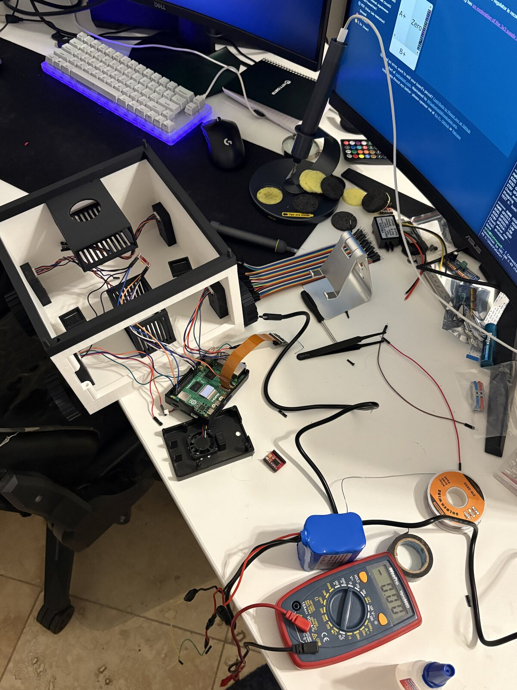 | 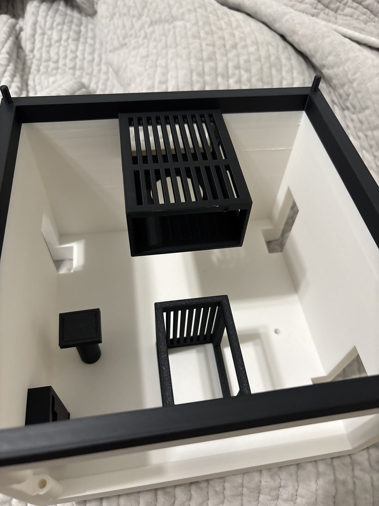 |

## Compressed-Air Foreign Object Deflection System — Ongoing

This is a physical aerospace prototype intended to redirect airborne foreign objects before they enter a sensitive aircraft structure.

- Built and tested a working system that uses object detection and directed compressed-air bursts to deflect foreign objects while they are in motion.
- Current development focuses on improving AI-assisted classification, trajectory estimation, and calculations for air-burst timing and force.
- Controlled recovery—predicting and guiding where a deflected object lands—remains in development.

## Click Bond AR Installation Study — Ongoing

Through an SMU industry collaboration with Click Bond, I help evaluate augmented-reality guidance for installing adhesive-bonded cable fasteners on an aircraft wing-rib test article.

- Apply fasteners using the AR-guided workflow.
- Capture completed assemblies with an Artec 3D scanner.
- Compare scan-derived measurements with reference CAD geometry to assess placement accuracy.

Selected details and media from sponsored work are intentionally omitted.

## CAD, Additive Manufacturing, and Customer Design

I use SolidWorks and FDM printing to move from a digital design to a testable physical part, then revise the geometry based on fit and function.

- Modify customer-selected STL geometry and redesign features for specific requirements.
- Plan part orientation, supports, tolerances, material use, batch layout, and reprint risk.
- Earned repeat business after a successful custom modification; the customer requested a follow-on batch of approximately 100 units.

| CAD-to-part validation | Mechanical-part printing | Batch production |
| --- | --- | --- |
| 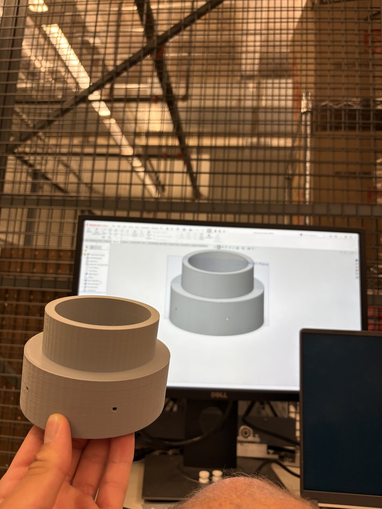 | 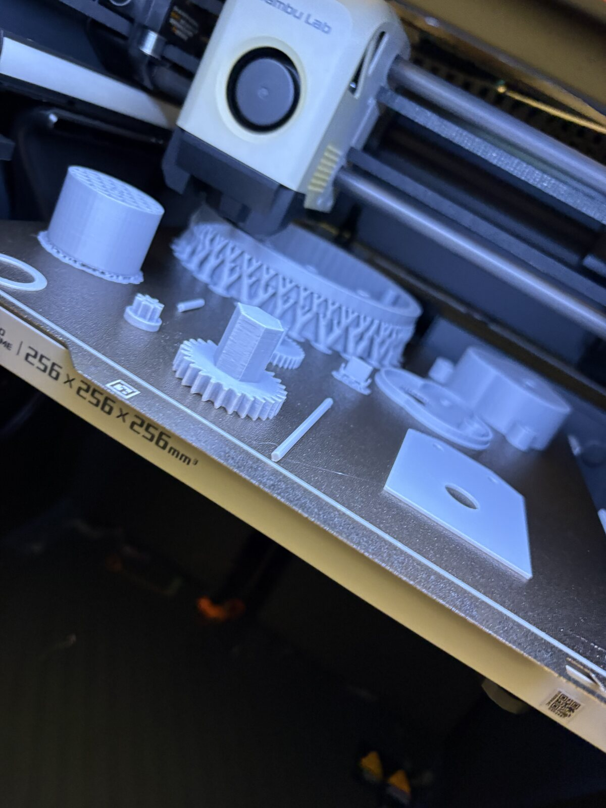 | 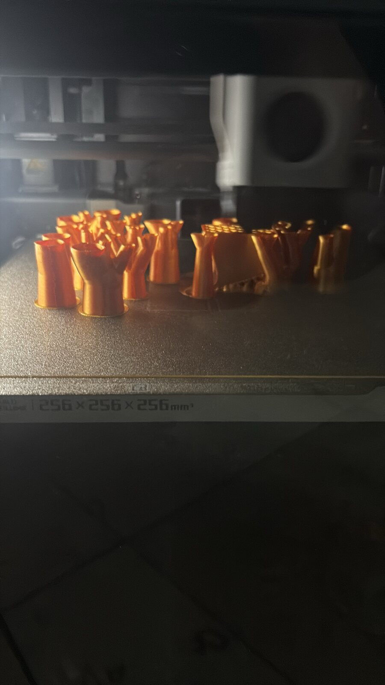 |

## Fabrication and Experimental Testing

My hands-on work includes welding, manual machining, soldering, dimensional measurement, and materials testing. I am comfortable learning a process from technical guidance, completing it carefully, and repeating it independently.

| Welding | Tensile testing |
| --- | --- |
| 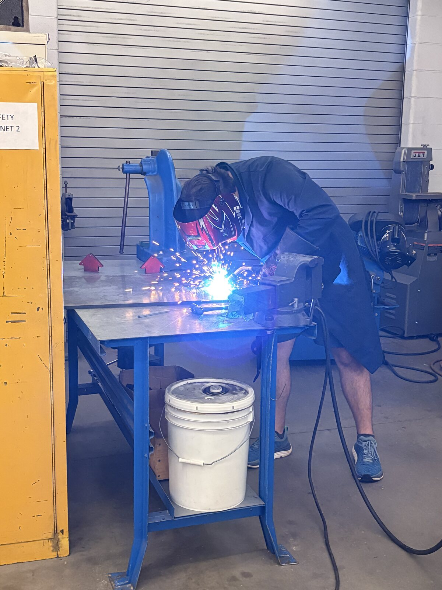 | 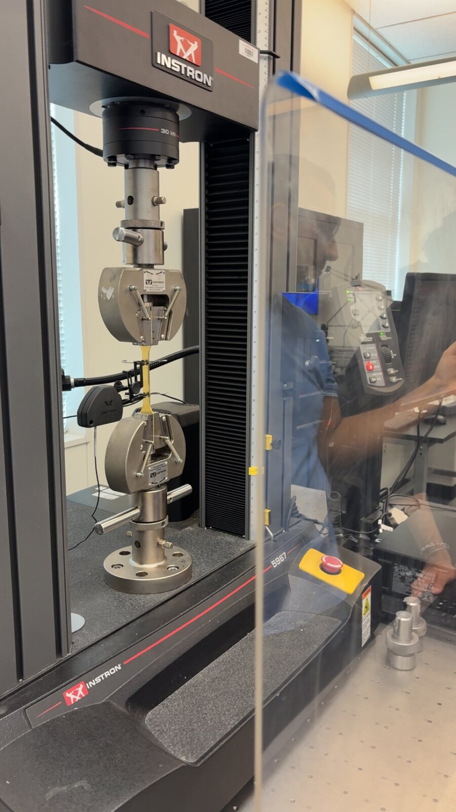 |

| Electronics soldering | Manual lathe work |
| --- | --- |
| 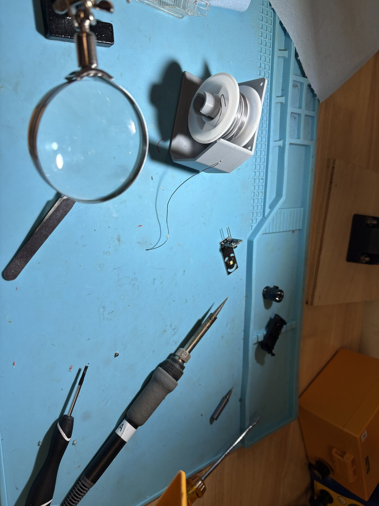 | 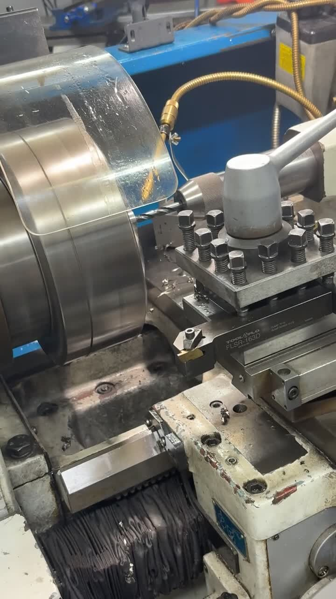 |

## Automotive Mechanical Work

I perform vehicle maintenance, diagnostics, component replacement, and interior or electrical work. These projects have developed my ability to follow service procedures, organize hardware, troubleshoot unexpected conditions, and return an assembly to working order.

| Engine-component service | Interior and electrical access |
| --- | --- |
| 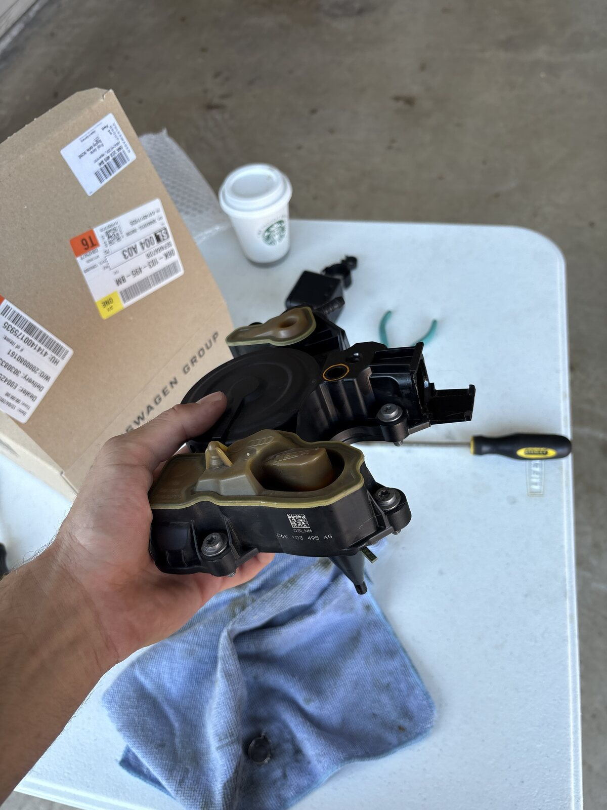 | 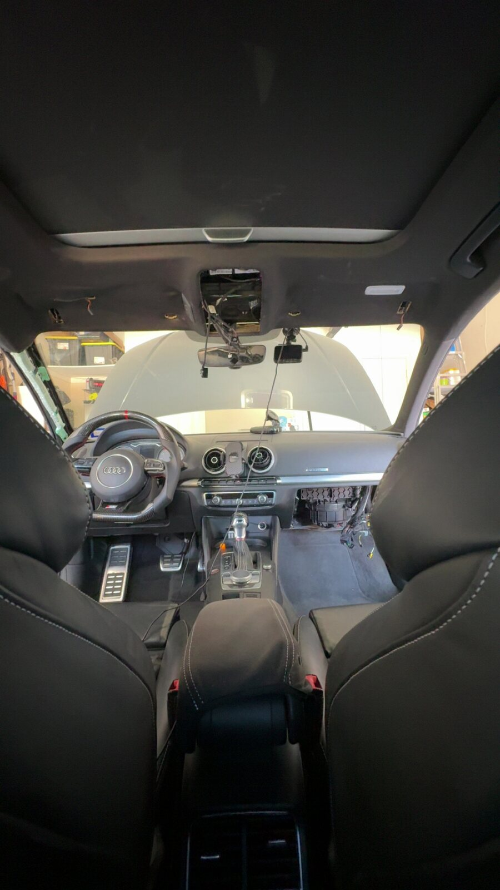 |

## Software Prototypes

- **Mobile detailing van configurator:** A concept and software prototype for selecting equipment, presenting customer-specific options, estimating price, and tracking vehicle payload.
- **Python trading bot:** An experimental prototype used to explore data handling, APIs, and rule-based automation. It is not presented as financial advice or as a production trading system.

## Technical Toolkit

| Area | Tools and experience |
| --- | --- |
| Programming and electronics | Python, Raspberry Pi, Linux/SSH, GPIO/PWM motor control, camera integration, API integration, soldering, multimeter use |
| Design and manufacturing | SolidWorks, FDM additive manufacturing, design iteration, print preparation, manual machining, welding |
| Metrology and testing | Artec 3D scanning, scan-to-CAD comparison, tensile testing, dimensional measurement, Excel engineering analysis |
| Current coursework | Dynamics, Thermodynamics, and Mechanics of Deformable Bodies (Fall 2026) |

## Next Steps

I am continuing to improve the robot's perception pipeline, develop the foreign-object deflection system, and document projects with clearer test results, CAD views, code samples, and short demonstration videos.
